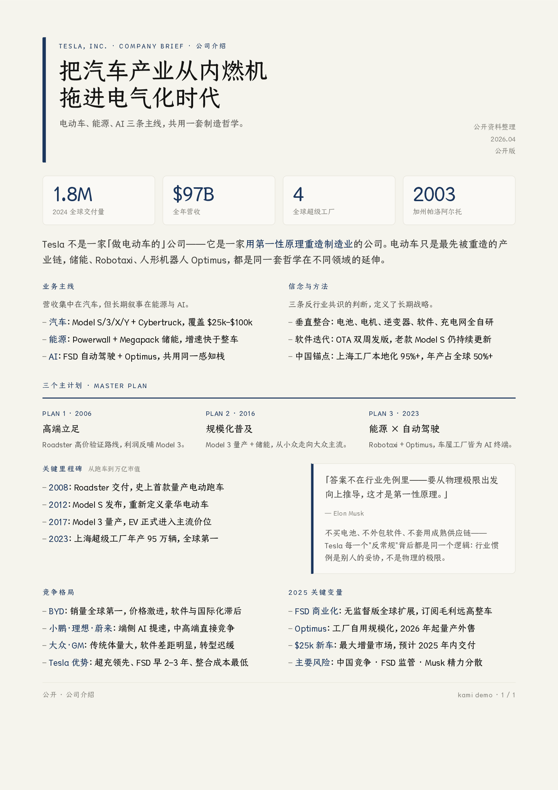
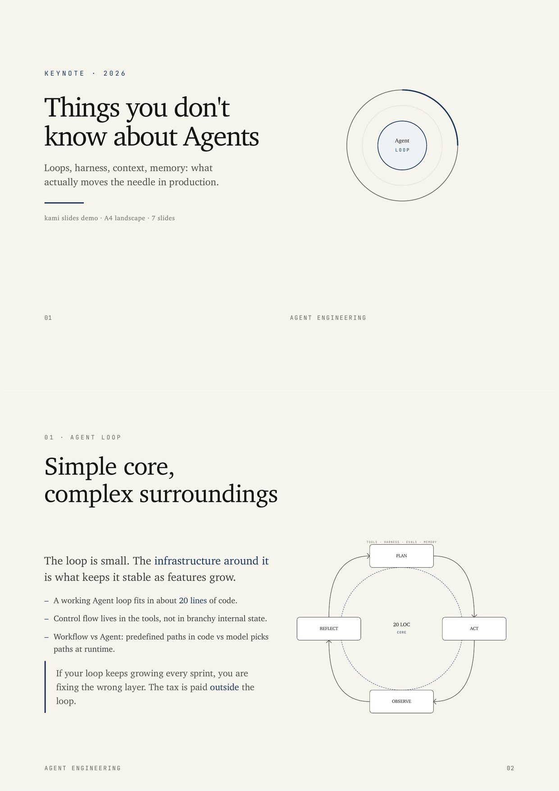
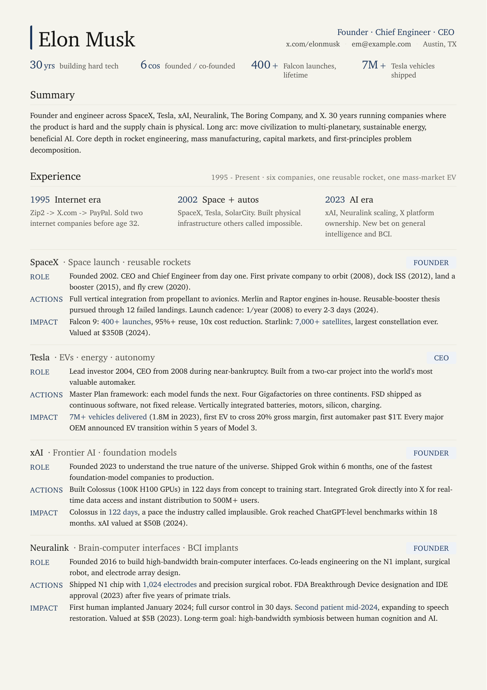
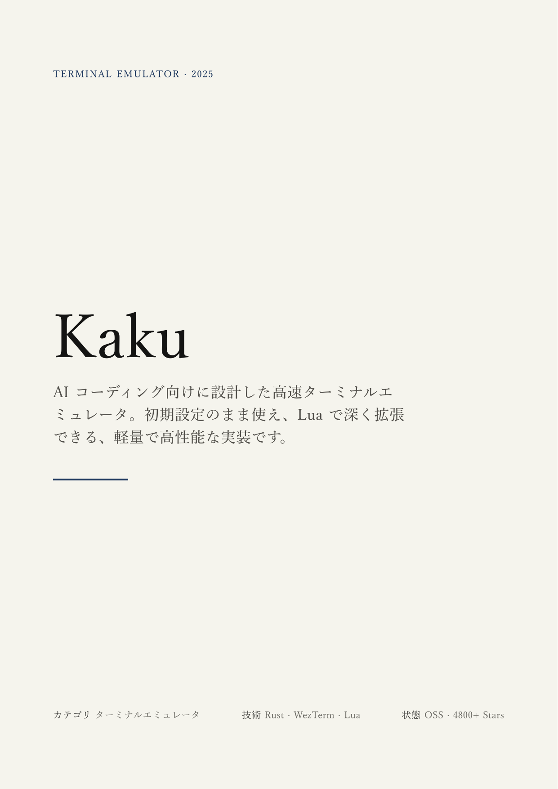

<div align="center">
  
  <h1>Kami</h1>
  <p><b>Good content deserves good paper.</b></p>
  <a href="https://github.com/tw93/kami/stargazers"></a>
  <a href="https://github.com/tw93/kami/releases"></a>
  <a href="LICENSE"></a>
  <a href="https://twitter.com/HiTw93"></a>
</div>

## Why

Kami (紙, かみ) means paper in Japanese: the surface where a finished idea lands. AI-generated documents keep drifting into generic gray, inconsistent styling, and layouts that change every session.

Kami is a document design system for the AI era: one constraint language, six formats, simple enough for agents to run reliably, strict enough to keep every output coherent and ready to ship. English and Chinese are first-class; Japanese works via a best-effort CJK path with visual QA before delivery.

Part of a trilogy: [Kaku](https://github.com/tw93/Kaku) (書く) writes code, [Waza](https://github.com/tw93/Waza) (技) drills habits, [Kami](https://github.com/tw93/Kami) (紙) delivers documents.

## See it

<table>
<tr>
  <td align="center" width="25%">
    <a href="assets/demos/demo-tesla.pdf"></a>
    <br><b>One-Pager</b> · 中文
    <br><sub>Tesla 公司介绍 · 单页</sub>
  </td>
  <td align="center" width="25%">
    <a href="assets/demos/demo-agent-slides.pdf"></a>
    <br><b>Slides</b> · English
    <br><sub>Agent keynote, 6 slides</sub>
  </td>
  <td align="center" width="25%">
    <a href="assets/demos/demo-musk-resume.pdf"></a>
    <br><b>Resume</b> · English
    <br><sub>Founder CV, 2 pages</sub>
  </td>
  <td align="center" width="25%">
    <a href="assets/demos/demo-kaku.pdf"></a>
    <br><b>Portfolio</b> · 日本語
    <br><sub>Kaku ターミナル作品集 · 7 ページ</sub>
  </td>
</tr>
</table>

## Usage

**Claude Code**

```bash
npx skills add tw93/kami -a claude-code -g -y
```

**Generic agents** (Codex, OpenCode, Pi, and other tools that read from `~/.agents/`)

```bash
npx skills add tw93/kami -a '*' -g -y
```

**Claude Desktop**

Download [kami.zip](https://cdn.jsdelivr.net/gh/tw93/kami@main/dist/kami.zip), open Customize > Skills > "+" > Create skill, and upload the ZIP directly (no need to unzip).

The ZIP is lightweight: Chinese fonts load from local checkout first, then jsDelivr CDN. If rendering is off, Claude downloads them on the next run. To update: download the same URL, click "..." on the skill card, choose Replace, upload.

The skill auto-triggers from natural requests, no slash command needed. Optimized for English and Chinese; Japanese supported via a best-effort CJK path with visual QA before delivery.

Example prompts by language:

- English: `make a one-pager for my startup` / `turn this research into a long doc` / `write a formal letter` / `make a portfolio of my projects` / `build me a resume` / `design a slide deck for my talk`
- 中文: `帮我做一份一页纸` / `帮我排版一份长文档` / `帮我写一封正式信件` / `帮我做一份作品集` / `帮我做一份简历` / `帮我做一套演讲幻灯片`
- 日本語: `スタートアップ向けの一枚資料を作って` / `この調査を長文レポートに整えて` / `正式な依頼文を作って` / `プロジェクト作品集を作って` / `履歴書を作って` / `登壇用スライドを作って`

**Optional: brand profile**

Drop a `.kami/brand.md` in your project (or `~/.kami/brand.md` globally) to persist author name, logo path, brand color, and default language. Kami loads it automatically before each render. Explicit prompts override profile defaults.

## Design

Warm parchment canvas, ink blue as the sole accent, serif carries hierarchy, no hard shadows or flashy palettes. Not a UI framework; a constraint system for printed matter. Documents should read as composed pages, not dashboards.

Six document types (One-Pager, Long Doc, Letter, Portfolio, Resume, Slides) with dedicated EN/CN templates and a best-effort Japanese path. Twelve inline SVG diagram types included. Kami picks the right variant based on the language you write in.

| Element | Rule |
|---|---|
| Canvas | `#f5f4ed` parchment, never pure white |
| Accent | Ink blue `#1B365D` only, no second chromatic hue |
| Neutrals | All warm-toned (yellow-brown undertone), no cool blue-grays |
| Serif | Body 400, headings 500. Avoid synthetic bold |
| Line-height | Tight titles 1.1-1.3, dense body 1.4-1.45, reading body 1.5-1.55 |
| Shadows | Ring or whisper only, no hard drop shadows |
| Tags | Solid hex backgrounds only. `rgba()` triggers a WeasyPrint double-rectangle bug |

**Fonts**: Each language uses a single serif font for the entire page. Chinese: TsangerJinKai02. Japanese: YuMincho. English: Charter. TsangerJinKai is free for personal use, commercial use requires a license from [tsanger.cn](https://tsanger.cn). All other fonts are system-bundled.

Full spec: [design.md](references/design.md). Cheatsheet: [CHEATSHEET.md](CHEATSHEET.md).

## Travel

The same constraint system doubles as a brief you can hand to any drawing tool. Point it at the [references folder](references/) and the output inherits warm parchment, ink-blue restraint, single-line geometric icons, and editorial typography.

> Apply the Kami design system from github.com/tw93/kami/tree/main/references

<table>
<tr>
  <td align="center" width="33%">
    
    <br><b>Evidence layout</b> · 中文
    <br><sub>Tesla Optimus 手部和前臂专利图一览</sub>
  </td>
  <td align="center" width="33%">
    
    <br><b>Architecture redraw</b> · English
    <br><sub>SpatialVLA Figure 1, schematic</sub>
  </td>
  <td align="center" width="33%">
    
    <br><b>Concept tradeoff</b> · 中文
    <br><sub>3D 表示的算力-推理性取舍</sub>
  </td>
</tr>
</table>

<sub>Rendered by ChatGPT Images 2.0 in a single pass with no manual touch-up. Kami specifies, the renderer draws.</sub>

## Background

I like investing in US equities and ask Claude to write research reports all the time. Every output landed in the same default-doc look: gray, flat, a different layout each session. The structure was hard to scan, the formatting felt dated, and nothing about the page made me want to keep reading. So I started fixing the typography, the palette, the spacing, one rule at a time, until the report became a page I actually enjoyed.

Later I needed to present "The Agent You Don't Know: Principles, Architecture and Engineering Practice." I already had the document and didn't want to build slides from scratch, so I used Claude Design to lay it out in my own style, tweaked it round after round, and eventually got it to a place I was happy with. That process added inline SVG charts, a unified warm palette, and a tighter editorial rhythm. It kept growing until it covered every document I regularly ship, so I kept abstracting the process, and it became kami: one quiet design system I can hand to any agent and trust the output.

## Support

- If kami helped you, [share it](https://twitter.com/intent/tweet?url=https://github.com/tw93/kami&text=Kami%20-%20A%20quiet%20design%20system%20for%20professional%20documents.) with friends or give it a star.
- Got ideas or bugs? Open an issue or PR.
- I have two cats, TangYuan and Coke. If you think kami delights your life, you can feed them <a href="https://miaoyan.app/cats.html?name=Kami" target="_blank">canned food</a>.

## License

MIT License for kami code and templates. Feel free to use and contribute.

**Fonts**: TsangerJinKai02 (Chinese) is free for personal use only; commercial use requires a license from [tsanger.cn](https://tsanger.cn). Charter (English), YuMincho (Japanese), and CJK fallbacks are system-bundled or open-licensed.
